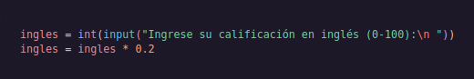
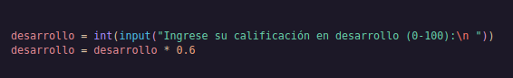
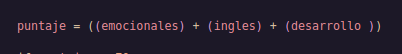
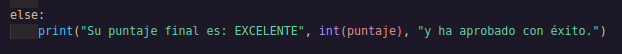

# _SEMESTER AVERAGE CALCULATOR_
---

## First part

In this section we ask the user to enter the grade they received in Socio-emotional Skills, which is equivalent to 20% of the final average.

---

## Second

Here the user will enter the English grade which is equivalent to 20% of the final average.

---

## third

Here you will enter the development grade, which is equivalent to 60% of the final average.

---

## quarter

With this we calculate the average

---
## fifth

Here we tell the program that if the score of the calculation performed is less than or equal to 70, its average is GOOD.

---

## sexet

In this part we tell the program that if the score is less than or equal to 30 it is REGULAR

---

## seventh

And finally, we tell you that if none of the above conditions were met, meaning the score is not less than 30 but also not less than 70, we tell you that your average is EXCELLENT.

