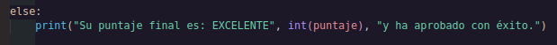

# _SEMESTER AVERAGE CALCULATOR_ 

---

## _Description_
<p>
This Python program calculates a student's final score based on three different evaluation areas: emotional skills, English, and development.
</p>
<p>
Each score must be entered by the user with a value between 0 and 100, and the program validates the input to ensure it is within the allowed range.
</p>

---
# _Features_

- User input validation
- Screen cleaning for a better console experience
- Weighted score calculation
- Final evaluation message

---

## _Score Weights_

<p>
  The final score is calculated using the following weights:
</p>

| Category | Weight |
|--------|--------|
| Emotional Skills | 20% |
| English | 20% |
| Development | 60% |

---

## _How It Works_
1. The program asks the user to enter their score in:
   - Emotional skills
   - English
   - Development
  2. Each value must be between **0 and 100**.
  3. If the user enters an invalid value, the program shows an error message and asks for the score again.
  4. The program calculates the weighted final score.
  5. Finally, it displays the performance result.

---

## _Result Categories_

- **Excellrnt** – High final score and successful approval.
- **GOOD** – Acceptable score and approved.
- **Regular** – Low score and not approved.

---

## _First part_

<p>
In this section we ask the user to enter the grade they received in Socio-emotional Skills, which is equivalent to 20% of the final average.
</p>


---

## _Second_

<p>
Here the user will enter the English grade which is equivalent to 20% of the final average.
</p>


---

## _third_

<p>
Here you will enter the development grade, which is equivalent to 60% of the final average.
</p>


---

## _quarter_

<p>
With this we calculate the average
</p>


---
## _fifth_

<p>
Here we tell the program that if the score of the calculation performed is less than or equal to 70, its average is GOOD.
</p>


---

## _sexet_

<p>
In this part we tell the program that if the score is less than or equal to 30 it is REGULAR
</p>


---

## _seventh_

<p>
And finally, we tell you that if none of the above conditions were met, meaning the score is not less than 30 but also not less than 70, we tell you that your average is EXCELLENT.
</p>



---

# _Example_

```
Enter your emotional skills score (0-100):
80

Enter your English score (0-100):
75

Enter your development score (0-100):
90

Output:
Your final score is: EXCELLENT 87 and you have successfully passed.
```