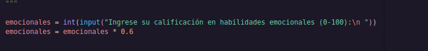
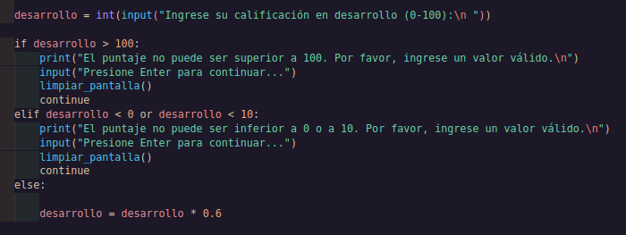
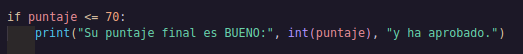
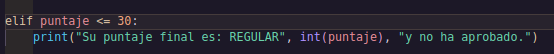
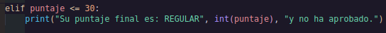

# _SEMESTER AVERAGE CALCULATOR_ 

---

## _Description_

This Python program calculates a student's final score based on three different evaluation areas: emotional skills, English, and development.
Each score must be entered by the user with a value between 0 and 100, and the program validates the input to ensure it is within the allowed range.

---

## _First part_

In this section we ask the user to enter the grade they received in Socio-emotional Skills, which is equivalent to 20% of the final average.

---

## _Second_

Here the user will enter the English grade which is equivalent to 20% of the final average.

---

## _third_

Here you will enter the development grade, which is equivalent to 60% of the final average.

---

## _quarter_

With this we calculate the average

---
## _fifth_

Here we tell the program that if the score of the calculation performed is less than or equal to 70, its average is GOOD.

---

## _sexet_

In this part we tell the program that if the score is less than or equal to 30 it is REGULAR

---

## _seventh_

And finally, we tell you that if none of the above conditions were met, meaning the score is not less than 30 but also not less than 70, we tell you that your average is EXCELLENT.

---

## _Score Weights_

  The final score is calculated using the following weights:

| Category | Weight |
|--------|--------|
| Emotional Skills | 20% |
| English | 20% |
| Development | 60% |

